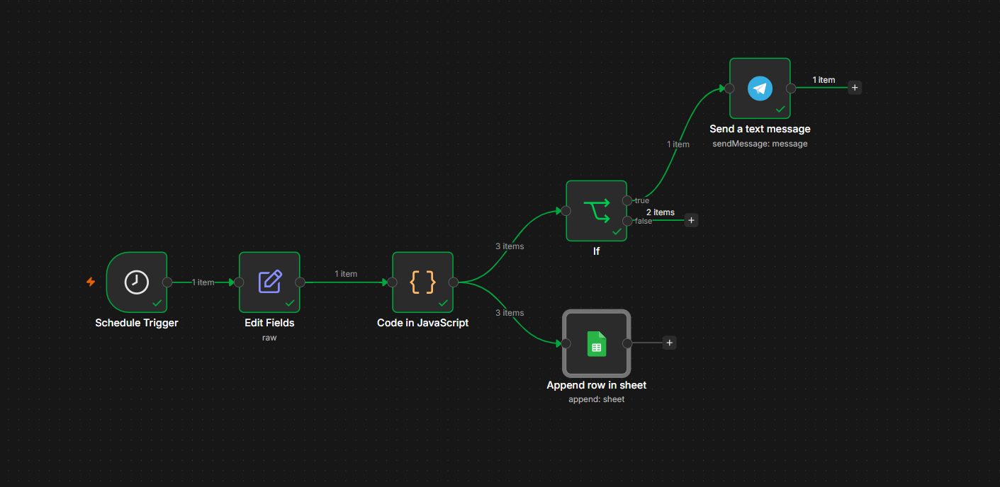

# SmartFare Tracker n8n

Automatización en n8n para monitorear precios de vuelos, registrar resultados en Google Sheets y enviar alertas por Telegram cuando un vuelo cumple una regla de precio barato.

## Stack

- n8n
- Docker + WSL2
- Nodo Code con JavaScript
- Google Sheets
- Telegram Bot API
- Google OAuth2

## MVP actual

- Corre automáticamente cada 1 hora.
- Genera precios simulados de vuelos.
- Registra todos los resultados en Google Sheets.
- Envía alertas por Telegram solo para vuelos baratos.
- Usa una arquitectura desacoplada para futura integración con APIs reales.

## Campos registrados

| Campo | Descripción |
| --- | --- |
| Timestamp | Momento de ejecución |
| Origin | Aeropuerto de origen |
| Destination | Aeropuerto de destino |
| Airline | Aerolínea |
| Price | Precio del vuelo |
| Alert_type | Clasificación del registro |

## Credenciales necesarias

Configurar dentro de n8n:

- Token del bot de Telegram
- Credenciales OAuth2 de Google Sheets

No subir tokens ni secretos al repositorio.

## Arquitectura

```text
Schedule Trigger
      ↓
Nodo Code (JavaScript)
      ↓
Proveedor simulado de vuelos
   ├── Registro histórico en Google Sheets
   └── IF precio < umbral
         └── Alerta por Telegram

## Vista del Workflow

