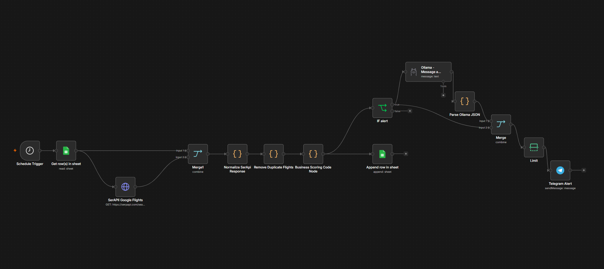

# SmartFare Tracker

[English](README.md)

SmartFare Tracker es un proyecto de automatización en n8n para monitorear tarifas de vuelos, evaluar resultados contra preferencias del usuario, guardar un historial auditable en Google Sheets y enviar alertas por Telegram cuando una tarifa cumple los criterios configurados.

El proyecto combina Google Forms, Google Sheets, SerpAPI Google Flights, reglas determinísticas de negocio, Ollama y Telegram. El modelo local de IA se usa solo para explicar la decisión; la decisión de alerta la toma el workflow con reglas explícitas de scoring.



## Workflow principal

El export principal de n8n es:

`workflows/google-form-serpapi-ollama-google-flights.sanitized.json`

Flujo general:

```text
Respuesta de Google Forms
-> Configuración en Google Sheets
-> n8n Schedule Trigger, cada 6 horas
-> Get row(s) in sheet
-> Normalize Form Config
-> SerpAPI Google Flights
-> Normalize SerpAPI Response
-> Remove Duplicate Flights
-> Business Scoring
-> Append row in Google Sheets history
-> IF alert
-> Explicación con Ollama
-> Parse Ollama JSON
-> Telegram Alert
```

Google Forms funciona como capa simple de entrada. Las respuestas se guardan en Google Sheets, y n8n lee esa hoja como fuente de configuración del workflow.

## Qué hace

- Lee preferencias de búsqueda de vuelos desde Google Sheets.
- Consulta datos reales de vuelos con SerpAPI Google Flights.
- Normaliza la respuesta del proveedor en registros consistentes.
- Elimina vuelos duplicados dentro de la misma ejecución.
- Aplica reglas determinísticas de scoring.
- Registra cada resultado evaluado en Google Sheets.
- Usa Ollama con `qwen2.5:7b` para generar una explicación breve en JSON.
- Envía alertas por Telegram para vuelos que superan el umbral configurado.

## Configuración de entrada

La configuración actual de Google Forms / Google Sheets espera campos como:

- `User Name`
- `Telegram Chat ID`
- `Origin Airport`
- `Destination Airport`
- `Outbound Date`
- `Maximum Price (USD)`
- `Maximum Stops`
- `Alert Threshold`
- `Enable Flight Alerts`

El nodo `Normalize Form Config` convierte esa entrada al formato interno del workflow:

- Los códigos de aeropuerto se limpian y pasan a mayúsculas.
- Las fechas pueden convertirse de `DD/MM/YYYY` a `YYYY-MM-DD`.
- Precio, escalas y umbral de alerta se convierten a números.
- `excellent_price` se calcula como 85% del precio máximo.
- `max_duration_minutes` actualmente queda fijo en 1500 minutos.
- La moneda por defecto es `USD`.

## Lógica de scoring

Cada vuelo empieza con un score de 100 puntos. Luego se aplican penalizaciones:

- Precio por encima del máximo configurado: `-40`
- Escalas por encima del máximo configurado: `-20`
- Duración por encima del máximo configurado: `-30`

El score final queda limitado entre 0 y 100.

```text
alert = score >= alert_threshold
```

Este enfoque mantiene la decisión principal transparente, predecible y fácil de auditar.

## Capa de razonamiento con Ollama

Ollama no decide si un vuelo es bueno o malo. n8n ya calcula el score y el indicador de alerta antes de llamar al modelo.

El nodo de Ollama recibe los datos del vuelo, el score, el estado de alerta y los motivos del scoring. Luego devuelve una explicación JSON con:

- `reason`
- `pros`
- `cons`

El nodo `Parse Ollama JSON` limpia y parsea la salida del modelo antes de construir el mensaje de Telegram.

## Estructura del repositorio

```text
.
├── docs/
│   ├── credentials.md
│   ├── local-llm-reasoning.md
│   └── workflow.md
├── examples/
│   └── ollama-flight-request.json
├── prompts/
│   └── flight-decision-prompt.md
├── scripts/
│   └── ollama-flight-judge.mjs
├── screenshots/
│   └── workflow-architecture.png
├── workflows/
│   ├── google-form-serpapi-ollama-google-flights.sanitized.json
│   ├── serpapi-ollama-google-flights.sanitized.json
│   └── smartfare-tracker-n8n.sanitized.json
├── docker-compose.yml
├── README.es.md
└── README.md
```

## Puesta en marcha

1. Levantar n8n localmente:

```bash
docker compose up -d
```

2. Importar el workflow sanitizado principal en n8n:

```text
workflows/google-form-serpapi-ollama-google-flights.sanitized.json
```

3. Crear o conectar el Google Sheets usado por el workflow:

- `config`: guarda las respuestas de Google Forms / configuración de búsqueda.
- `flight_history`: guarda los vuelos evaluados.

4. Configurar credenciales dentro de n8n:

- Google Sheets OAuth2
- Bot de Telegram
- Ollama
- API key de SerpAPI para el nodo HTTP de Google Flights

5. Descargar el modelo local de Ollama:

```bash
ollama pull qwen2.5:7b
```

6. Revisar el nodo de Telegram después de importar. El export sanitizado usa un chat ID de ejemplo, por lo que hay que reemplazarlo por el chat ID real o adaptarlo para usar el campo normalizado `telegram_chat_id`.

## Prueba local de Ollama

La capa de razonamiento se puede probar fuera de n8n:

```bash
node scripts/ollama-flight-judge.mjs
```

El payload de ejemplo está en:

`examples/ollama-flight-request.json`

## Seguridad

- No subir API keys, tokens, chat IDs reales ni credenciales de Google.
- Mantener `.env`, `n8n_data/`, `.ollama/` y archivos de credenciales fuera de Git.
- Usar exports sanitizados para repositorios públicos.
- Configurar las credenciales reales dentro de n8n después de importar el workflow.

## Estado actual

Este proyecto es un MVP funcional. Puede leer configuración desde Google Sheets, consultar vuelos reales con SerpAPI, calcular score, registrar resultados, generar explicaciones con Ollama y enviar alertas por Telegram.

## Limitaciones actuales

- El campo `enabled` se normaliza, pero todavía falta un filtro explícito antes de llamar APIs externas.
- El ruteo multiusuario real por Telegram no está completamente implementado en el export sanitizado.
- Todavía no hay mapeo de ciudades amigables a códigos IATA.
- El workflow espera códigos de aeropuerto como `EZE`, `YYZ` o `YWG`.
- La deduplicación funciona dentro de una ejecución, no contra todo el histórico.
- `max_duration_minutes` está fijo dentro del workflow.
- Las alertas de Telegram están limitadas a tres items por ejecución.

## Roadmap

- Agregar validación antes de llamar a SerpAPI.
- Mapear ciudades amigables a códigos de aeropuerto con una hoja `city_dictionary`.
- Filtrar configuraciones desactivadas antes de llamar APIs externas.
- Mejorar la deduplicación contra el histórico.
- Usar Telegram Chat IDs dinámicos por usuario.
- Separar histórico productivo, histórico de pruebas y errores de configuración.
- Permitir preferencias libres interpretadas por el modelo local.
- Mejorar la capa de presentación para la demo final.
